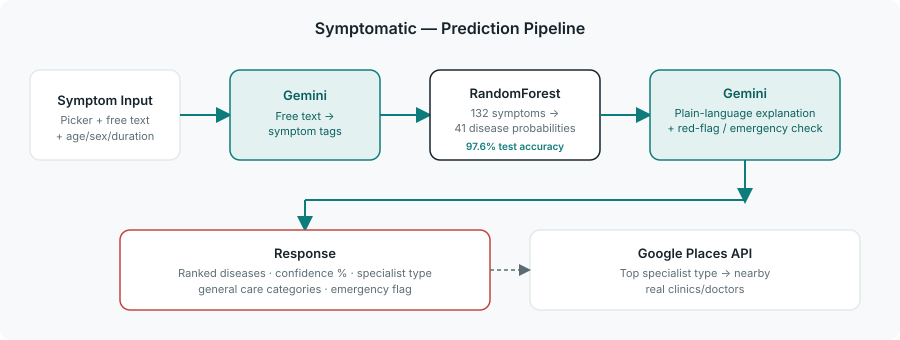

# 🩺 Symptomatic — AI Medical Diagnosis Assistant

An AI-assisted symptom triage tool. You describe your symptoms; a trained
machine learning model ranks possible conditions by confidence, an LLM
explains the results in plain language and flags anything urgent, and the
app helps you find a nearby specialist to follow up with.

> **This is not a medical diagnosis.** It's a decision-support tool that
> gives general information to help you decide what to do next. Always
> consult a licensed healthcare professional, and seek emergency care
> immediately for severe or worsening symptoms. See [Safety & Scope](#safety--scope)
> below for how this is enforced throughout the app.




## Features

- **Symptom input** — searchable multi-select picker (132 recognized symptoms) plus a free-text box parsed by an LLM
- **ML disease prediction** — a RandomForest classifier trained on a public 41-disease / 132-symptom dataset, **97.6% test accuracy**
- **Confidence scoring** — every prediction is ranked with a 0–100% confidence score, never a flat "yes/no"
- **AI explanation layer** — Gemini translates the raw ML output into a plain-language summary and flags red-flag/urgent symptoms
- **General care guidance** — medicine *categories* only (e.g. "antihistamines"), never specific drugs or doses — always paired with "consult a doctor"
- **Nearby specialists** — Google Places integration maps the top predicted condition to a specialist type and finds real nearby providers
- **History** — every check is saved so you can track what you've reported over time

## Tech stack

| Layer | Technology |
|---|---|
| ML model | scikit-learn (RandomForest), trained on a public Kaggle symptom-disease dataset |
| LLM | Google Gemini (`google-genai` SDK) — optional, app runs with template fallbacks if no API key is set |
| Backend | FastAPI, SQLAlchemy, SQLite, JWT auth |
| Frontend | React 18, Vite, Tailwind CSS, React Router |
| Places | Google Places API (Text Search) — optional |
| Deployment | Docker + docker-compose, nginx |

## How the prediction pipeline works

```
User symptoms (picked + free text)
        │
        ▼
Free text → Gemini → structured symptom tags (falls back to substring match)
        │
        ▼
Symptom vector (132 binary features) → RandomForest.predict_proba()
        │
        ▼
Top-K ranked diseases with confidence scores
        │
        ▼
Gemini → plain-language explanation + red-flag detection
        │
        ▼
Response: ranked predictions + explanation + specialist type + emergency flag
```

The ML model does the quantitative work (it's fast, deterministic, and its
confidence scores are real probabilities from the classifier — not an LLM
guessing at a percentage). The LLM sits on top purely as an explanation and
safety layer, and is intentionally **not** used to invent new diagnoses.

## Project structure

```
ai-medical-diagnosis-assistant/
├── backend/
│   ├── app/
│   │   ├── core/          # config, database, security, auth deps
│   │   ├── models/        # SQLAlchemy models
│   │   ├── schemas/       # Pydantic request/response schemas
│   │   ├── routers/       # auth, diagnosis
│   │   ├── services/      # gemini_service, places_service
│   │   ├── ml/            # train_model.py, predict.py, disease_info.py, artifacts/
│   │   └── main.py
│   ├── data/               # Training.csv, Testing.csv (public dataset)
│   ├── requirements.txt
│   ├── Dockerfile
│   └── .env.example
├── frontend/
│   ├── src/
│   │   ├── pages/          # Login, Register, SymptomChecker, Results, History
│   │   ├── components/     # SymptomPicker, PredictionCard, DisclaimerBanner, ...
│   │   ├── context/         # AuthContext
│   │   └── services/        # api.js, diagnosisService.js
│   ├── Dockerfile
│   ├── nginx.conf
│   └── .env.example
├── docker-compose.yml
└── LICENSE
```

## Getting started (local development)

### 1. Backend

```bash
cd backend
python3 -m venv venv && source venv/bin/activate   # optional but recommended
pip install -r requirements.txt

cp .env.example .env
# Edit .env — GEMINI_API_KEY and GOOGLE_PLACES_API_KEY are optional but
# recommended for the full experience.

# Train the ML model (only needs to be run once — writes to app/ml/artifacts/)
python -m app.ml.train_model

uvicorn app.main:app --reload --port 8000
```

Backend runs at `http://localhost:8000`. Interactive API docs at `http://localhost:8000/docs`.

### 2. Frontend

```bash
cd frontend
npm install
cp .env.example .env   # defaults work out of the box for local dev
npm run dev
```

Frontend runs at `http://localhost:5173` and proxies `/api/*` calls to the backend.

## Getting started (Docker)

```bash
cp backend/.env.example backend/.env   # fill in API keys if you have them
docker compose up --build
```

- Frontend: `http://localhost`
- Backend API: `http://localhost:8000`

The model is trained automatically during the backend image build.

## Configuration

All configuration is via environment variables (see `backend/.env.example`):

| Variable | Required? | Purpose |
|---|---|---|
| `SECRET_KEY` | Yes | JWT signing secret — generate a real random value for production |
| `GEMINI_API_KEY` | No | Enables AI-generated explanations; falls back to templates without it |
| `GOOGLE_PLACES_API_KEY` | No | Enables the "nearby specialists" search; returns an empty result with a note without it |
| `DATABASE_URL` | No | Defaults to local SQLite; point at Postgres for production |

## Dataset & model

The classifier is trained on a public "Disease Prediction Using Machine
Learning" dataset (132 binary symptom features, 41 disease labels, ~4,900
records), included in `backend/data/`. Retrain anytime with:

```bash
python -m app.ml.train_model
```

This prints cross-validation and held-out test accuracy so you can verify
the model before deploying.

## Testing

```bash
cd backend
pip install -r requirements.txt   # includes pytest
pytest tests/ -v
```

The test suite covers auth (register/login/duplicate-email/wrong-password),
the core diagnosis pipeline (symptom matching, confidence scoring, emergency
flagging), and access control (history, specialist search). CI runs this
automatically on every push via GitHub Actions (`.github/workflows/ci.yml`),
alongside a frontend build check.

## Safety & scope

This project is a portfolio/demo application, not a certified medical
device, and should not be treated as one. Specific design choices exist to
keep it responsible:

- Predictions are always shown as ranked **possibilities with confidence
  scores**, never a single definitive diagnosis.
- "Medicine suggestions" are general **categories** only (e.g. "antihistamines",
  "rest and fluids") — never specific drug names or dosages.
- Conditions that can be serious (heart attack, brain hemorrhage, dengue,
  malaria, severe drug reactions, alcoholic hepatitis) are flagged as
  emergencies in the data layer, and the UI surfaces this prominently.
- A disclaimer is shown on every page that displays health information.

If you extend this project, please preserve these guardrails.

## Extending this project

- **Swap the ML model**: `app/ml/predict.py` and `app/ml/train_model.py` are
  self-contained — drop in a different dataset or model architecture (e.g.
  gradient boosting, a small neural net) without touching the API layer.
- **Add authentication providers**: OAuth via Google/GitHub instead of
  email/password.
- **Add a symptom timeline**: track symptom changes over multiple check-ins
  per condition.
- **Multi-language support**: the Gemini prompts can be adapted to respond
  in the user's language.

## License

MIT — see [LICENSE](LICENSE).
